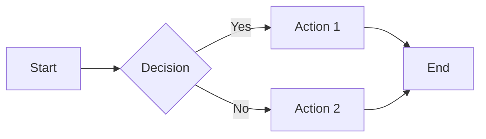
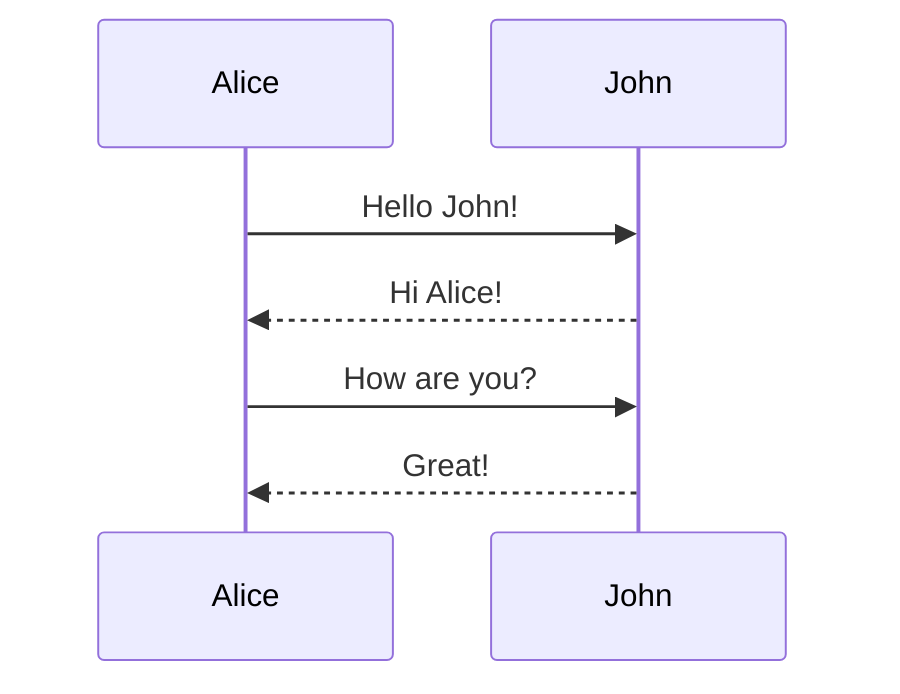
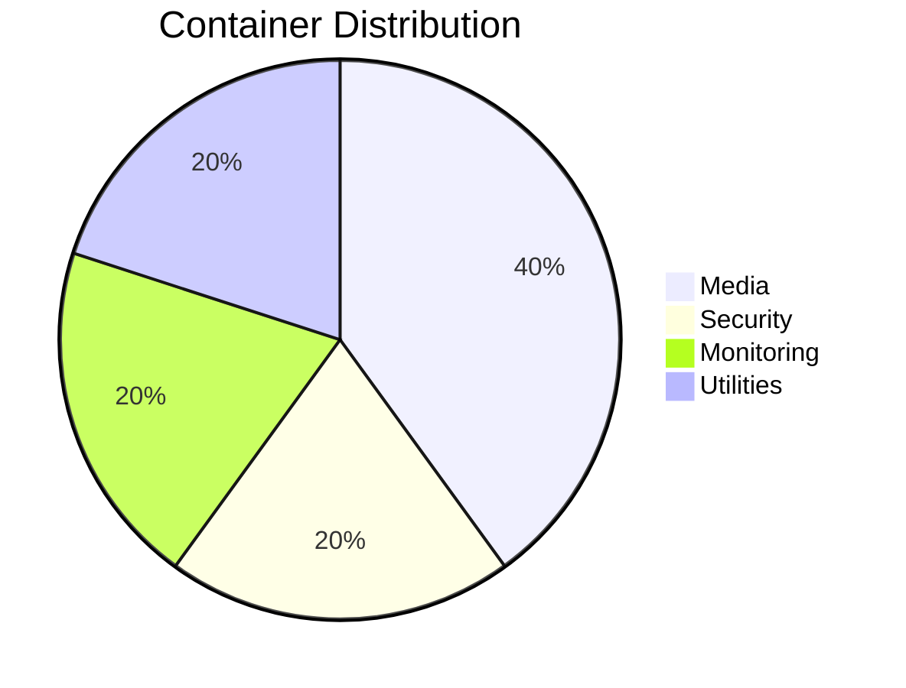

---
hide:
  - toc
#   - navigation
---

# :material-format-text: Markdown Examples

A showcase of Material for MkDocs features and markdown syntax you can use throughout this wiki.

-----

## :material-format-header-pound: Headers

```markdown
# H1 Header
## H2 Header
### H3 Header
#### H4 Header
##### H5 Header
###### H6 Header
```

-----

## :material-format-text-variant: Text Formatting

**Bold text** - `**Bold text**`

*Italic text* - `*Italic text*`

~~Strikethrough~~ - `~~Strikethrough~~`

==Highlighted text== - `==Highlighted text==`

^^Underlined text^^ - `^^Underlined text^^`

Sub~script~ - `Sub~script~`

Super^script^ - `Super^script^`

-----

## :material-format-list-bulleted: Lists

### Unordered List

- Item 1
- Item 2
  - Nested item 2.1
  - Nested item 2.2
- Item 3

### Ordered List

1. First item
1. Second item
    1. Nested item 2.1
    1. Nested item 2.2
1. Third item

### Task List

- [x] Completed task
- [ ] Uncompleted task
- [ ] Another task

-----

## :material-link: Links

[Internal link](../index.md)

[External link](https://www.example.com)

[Link with title](https://www.example.com "This is a title")

-----

## :material-code-tags: Code

### Inline Code

    Use `inline code` like this.

### Code Blocks

```python
def hello_world():
    print("Hello, World!")
    return True
```

### Code with Line Numbers

```python linenums="1"
def calculate_sum(a, b):
    result = a + b
    return result
```

### Code with Highlighting

```python hl_lines="2 3"
def example():
    # This line is highlighted
    # This line too
    return None
```

### Code with Annotations

```yaml
version: '3.8'  # (1)!

services:
  app:
    image: myapp:latest  # (2)!
    ports:
      - "8080:8080"  # (3)!
```

1. Docker Compose file version
1. Uses the latest image
1. Maps port 8080

-----

## :material-alert: Admonitions

!!! note
    This is a note admonition.

!!! abstract
    This is an abstract/summary admonition.

!!! info
    This is an info admonition.

!!! tip
    This is a tip admonition.

!!! success
    This is a success admonition.

!!! question
    This is a question admonition.

!!! warning
    This is a warning admonition.

!!! failure
    This is a failure admonition.

!!! danger
    This is a danger admonition.

!!! bug
    This is a bug admonition.

!!! example
    This is an example admonition.

!!! quote
    This is a quote admonition.

### Collapsible Admonitions

??? note "Click to expand"
    This content is hidden by default.

???+ tip "Expanded by default"
    This starts open but can be collapsed.

### Custom Titles

!!! warning "Custom Warning Title"
    You can customize the title of any admonition!

-----

## :material-table: Tables

|Header 1   |Header 2   |Header 3   |
|-----------|-----------|-----------|
|Row 1 Col 1|Row 1 Col 2|Row 1 Col 3|
|Row 2 Col 1|Row 2 Col 2|Row 2 Col 3|

### Aligned Tables

|Left|Center|Right|
|:---|:----:|----:|
|Text|Text  |Text |
|More|More  |More |

-----

## :material-image: Images

```markdown


```

-----

## :material-format-quote-close: Blockquotes

> This is a blockquote.
>
> It can span multiple lines.

> Nested blockquotes:
> > This is nested.

-----

## :material-math-integral: Math (if enabled)

Inline math: $E = mc^2$

Block math:
$$
\frac{n!}{k!(n-k)!} = \binom{n}{k}
$$

-----

## :material-emoticon: Emojis

### Material Icons

- :material-docker: `:material-docker:`
- :material-check-circle: `:material-check-circle:`
- :material-alert: `:material-alert:`
- :material-heart: `:material-heart:`

### Unicode Emoji

- 😊 `:smile:`
- 🚀 `:rocket:`
- ✅ `:white_check_mark:`
- ❌ `:x:`
- 🔒 `:lock:`

-----

## :material-keyboard: Keyboard Keys

++ctrl+alt+del++

```markdown
++ctrl+alt+del++
++cmd+c++
++shift+enter++
```

-----

## :material-tab: Tabs

=== "Tab 1"

    ```
    Content for tab 1
    ```

=== "Tab 2"

    ```
    Content for tab 2
    ```

=== "Tab 3"

    ```
    Content for tab 3
    ```

### Code Tabs

=== "Python"
    ```python
    def hello():
        print("Hello, World!")
    ```

=== "JavaScript"
    ```javascript
    function hello() {
        console.log("Hello, World!");
    }
    ```

=== "Bash"
    ```bash
    echo "Hello, World!"
    ```

-----

## :material-checkbox-marked: Definition Lists

```markdown
Term 1
:   Definition for term 1

Term 2
:   Definition for term 2
:   Another definition for term 2
```

**Rendered:**

Term 1
:   Definition for term 1

Term 2
:   Definition for term 2
:   Another definition for term 2

-----

## :material-arrow-right: Horizontal Rules

-----

Three or more dashes, asterisks, or underscores create a horizontal rule:

```markdown
---
```

**Rendered:**

-----

```markdown
***
```

**Rendered:**

***

```markdown
___
```

**Rendered:**

___
-----

## :material-alert-box: Special Blocks

### HTML with Theme-Aware Classes

You can use HTML with CSS classes that automatically adapt to the theme:

```html
<div class="custom-block">
    <strong>Custom HTML Block</strong>
    <p>This block automatically changes color based on light/dark mode!</p>
</div>
```

**Rendered:**

<div class="custom-block">
    <strong>Custom HTML Block</strong>
    <p>This block automatically changes color based on light/dark mode!</p>
</div>

### Footnotes

Here’s a sentence with a footnote[^1].

[^1]: This is the footnote content.

### Abbreviations

The HTML specification is maintained by the W3C.

*[HTML]: Hyper Text Markup Language
*[W3C]: World Wide Web Consortium

-----

## :material-chart-line: Mermaid Diagrams

### Flowchart



### Sequence Diagram



### Pie Chart



-----

## :material-file-code: HTML in Markdown

You can use HTML directly in markdown:

<div style="background-color: #f0f0f0; padding: 10px; border-radius: 5px;">
    <strong>Custom HTML Block</strong>
    <p>This is a custom styled block using HTML.</p>
</div>

-----

## :material-format-color-highlight: Syntax Highlighting

Material for MkDocs supports many languages:

### YAML

```yaml
key: value
list:
  - item1
  - item2
```

### JSON

```json
{
  "name": "example",
  "version": "1.0.0"
}
```

### Bash

```bash
#!/bin/bash
echo "Hello, World!"
docker ps
```

### Docker

```dockerfile
FROM ubuntu:latest
RUN apt-get update
CMD ["bash"]
```

-----

## :material-information: Useful Combinations

### Command with Output

Input:

```bash
docker ps
```

Output:

```
CONTAINER ID   IMAGE     COMMAND   STATUS
abc123def456   nginx     ...       Up 2 hours
```

### Warning with Code

!!! warning "Important Configuration"
    Make sure to set the correct permissions:

    ```bash
    chmod 600 acme.json
    ```

### Collapsible Example

??? example "Click to see full docker-compose.yml"
    ```yaml
    version: ‘3.8’

    services:
      app:
        image: myapp:latest
        ports:
          - "8080:8080"
        environment:
          - ENV=production
        restart: unless-stopped
    ```

-----

## :material-palette: Custom Styling

### Buttons (using HTML)

<button style="background-color: #4CAF50; color: white; padding: 10px 20px; border: none; border-radius: 5px; cursor: pointer;">
  Click Me
</button>

### Badges

<span style="background-color: #2196F3; color: white; padding: 3px 8px; border-radius: 3px; font-size: 0.8em;">New</span>
<span style="background-color: #f44336; color: white; padding: 3px 8px; border-radius: 3px; font-size: 0.8em;">Deprecated</span>
<span style="background-color: #4CAF50; color: white; padding: 3px 8px; border-radius: 3px; font-size: 0.8em;">Stable</span>

-----

## :material-help-circle: Tips for Writing Good Documentation

!!! tip "Best Practices"
    - Use clear, descriptive headers
    - Include code examples
    - Add admonitions for important information
    - Use tables for structured data
    - Include diagrams where helpful
    - Keep paragraphs short and focused
    - Use lists for easy scanning
    - Add emoji/icons for visual interest
    - Link to related pages
    - Include search keywords

-----

<div class="center" markdown>

**Now go create some beautiful documentation!** :material-pencil:

</div>
