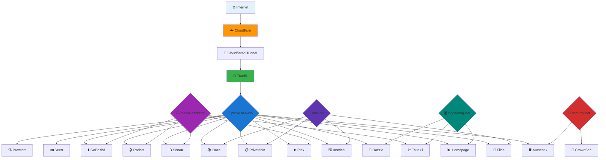

---
hide:
  - toc
---
# :material-network: Homelab Networking Architecture

Custom Docker bridge networks for isolation, security, and clean service communication.

!!! success ":material-shield-check: Network Design Philosophy"
    Minimal  public exposure — only necessary services on the `proxy` network. Everything else stays internal and secure!

-----

## :material-sitemap: Network Overview

|Network           |Purpose                        |Subnet       |Driver|Services                   |
|------------------|-------------------------------|-------------|------|---------------------------|
|**proxy**         |Traefik ingress (public-facing)|172.20.0.0/16|bridge|All web-accessible services|
|**media-backend** |Media stack communication      |172.21.0.0/16|bridge|*arr apps, Plex, SABnzbd   |
|**monitoring-net**|Monitoring & dashboards        |172.22.0.0/16|bridge|Homepage, Dozzle, Tautulli |
|**security-net**  |Security & authentication      |172.23.0.0/16|bridge|Authentik, CrowdSec        |
|**utils-net**     |Isolated utilities             |172.24.0.0/16|bridge|FileBrowser, Immich, Privatebin, Docs   |

!!! info ":material-information: Subnets"
    Each network uses a /16 subnet providing 65,534 possible IP addresses per network.

-----

## :material-chart-sankey: Network Topology



-----

## :material-network-outline: Network Details

### :material-web: proxy

**Public-facing ingress network**

- **Purpose:** Routes all external web traffic through Traefik
- **Subnet:** `172.20.0.0/16`
- **Gateway:** `172.20.0.1`
- **Exposure:** Public internet via Cloudflare Tunnel

**Connected Services:**

- Traefik (gateway)
- Authentik
- Homepage
- Dozzle
- Plex
- All *arr apps (Sonarr, Radarr, Prowlarr)
- SABnzbd
- Seerr
- Tautulli
- Filebrowser Quantum
- Immich
- Privatebin
- These Docs
- Title Card Maker
- Unmanic
- Posterizarr

!!! danger ":material-alert: Security Critical"
    This is your only network exposed to the internet. Only add services that NEED web access!

??? example "Creating the proxy network"
    `bash docker network create \ --driver bridge \ --subnet 172.20.0.0/16 \ --gateway 172.20.0.1 \ proxy`

-----

### :material-movie: media-backend

**Internal media stack communication**

- **Purpose:** Allows *arr apps to communicate with Plex and each other
- **Subnet:** `172.21.0.0/16`
- **Gateway:** `172.21.0.1`
- **Exposure:** Internal only

**Connected Services:**

- Plex
- Sonarr
- Radarr
- Prowlarr
- SABnzbd
- Tautulli
- Kometa
- Title Card Maker
- ImageMaid
- Posterizarr
- Unmanic

**Communication Flows:**

- Sonarr/Radarr → Prowlarr (indexer queries)
- Sonarr/Radarr → SABnzbd (download requests)
- Sonarr/Radarr → Plex (library updates)
- Tautulli → Plex (statistics gathering)
- Kometa → Plex (metadata management)

!!! info ":material-information: Why Separate?"
    This network keeps media-related traffic isolated from monitoring and security services.

??? example "Creating the media-backend network"
    `bash docker network create \ --driver bridge \ --subnet 172.21.0.0/16 \ --gateway 172.21.0.1 \ media-backend`

-----

### :material-monitor-dashboard: monitoring-net

**Monitoring and dashboard services**

- **Purpose:** Isolates monitoring tools from production services
- **Subnet:** `172.22.0.0/16`
- **Gateway:** `172.22.0.1`
- **Exposure:** Internal only

**Connected Services:**

- Homepage
- Dozzle
- Tautulli
- Notifiarr

**Communication Flows:**

- Homepage → All services (status checks via APIs)
- Dozzle → Docker socket (log streaming)
- Notifiarr → *arr apps (notifications)

!!! tip ":material-lightbulb: Monitoring Best Practice"
    Keep monitoring separate so issues in production don’t affect your ability to troubleshoot.

??? example "Creating the monitoring-net network"
    `bash docker network create \ --driver bridge \ --subnet 172.22.0.0/16 \ --gateway 172.22.0.1 \ monitoring-net`

-----

### :material-shield-lock: security-net

**Security and authentication services**

- **Purpose:** Isolates security-critical services
- **Subnet:** `172.23.0.0/16`
- **Gateway:** `172.23.0.1`
- **Exposure:** Internal only

**Connected Services:**

- Authentik
- Authentik PostgreSQL
- CrowdSec
- Cloudflare Bouncer

**Communication Flows:**

- Authentik → Authentik DB (user data)
- CrowdSec → Traefik logs (threat analysis)
- Cloudflare Bouncer → Cloudflare API (ban sync)
- All services → Authentik (SSO authentication)

!!! danger ":material-shield-alert: Maximum Security"
    Never expose this network publicly. Contains master authentication and security systems!

??? example "Creating the security-net network"
    `bash docker network create \ --driver bridge \ --subnet 172.23.0.0/16 \ --gateway 172.23.0.1 \ security-net`

-----

### :material-tools: utils-net

**Utility services**

- **Purpose:** Isolates miscellaneous utility services
- **Subnet:** `172.24.0.0/16`
- **Gateway:** `172.24.0.1`
- **Exposure:** Internal only (web access via proxy network)

**Connected Services:**

- Filebrowser Quantum
- Immich
- Privatebin
- These Docs (MkDocs)

!!! info ":material-information: Isolation Benefits"
    Keeps utility services separate from critical infrastructure.

??? example "Creating the utils-net network"
    `bash docker network create \ --driver bridge \ --subnet 172.24.0.0/16 \ --gateway 172.24.0.1 \ utils-net`

-----

## :material-transit-connection-variant: Multi-Network Containers

Some containers connect to multiple networks for different purposes:

### Services on Both proxy + media-backend

- **Plex** - Web access + media stack communication
- **Sonarr** - Web UI + *arr coordination
- **Radarr** - Web UI + *arr coordination
- **Prowlarr** - Web UI + indexer sharing
- **SABnzbd** - Web UI + download coordination
- **Tautulli** - Web UI + Plex monitoring

### Services on Both proxy + monitoring-net

- **Homepage** - Web access + service monitoring
- **Dozzle** - Web access + container monitoring
- **Tautulli** - Web access + Plex statistics

### Services on Both proxy + security-net

- **Authentik** - Web access + authentication provider

### Services on Both proxy + utils-net

- **Filebrowser Quantum** - Web access + file browsing
- **Immich** - Web access + photo storage
- **Privatebin** - Web access + paste storage
- **These Docs** - Web access + documentation

-----

## :material-network-strength-4: Network Security Matrix

|Network           |Public Internet |Traefik  |Internal Only|Database Access|
|------------------|:----------------:|:---------:|:-----------:|:-------------:|
|**proxy**         |✅ Via Cloudflare|✅ Gateway|❌            |❌              |
|**media-backend** |❌               |Via proxy|✅            |❌              |
|**monitoring-net**|❌               |Via proxy|✅            |❌              |
|**security-net**  |❌               |Via proxy|✅            |✅ (Authentik)  |
|**utils-net**     |❌               |Via proxy|✅            |❌              |

-----

## :material-vpn: Host-Level Networking

### Tailscale VPN

**Secure remote access without Docker networking**

- **Type:** Host-level service (not a Docker network)
- **Purpose:** Secure remote access from anywhere
- **Authentication:** Tailscale account + MagicDNS
- **Features:**
  - Zero-config VPN
  - Encrypted tunnels
  - No port forwarding
  - Works alongside Cloudflare Tunnel

!!! tip ":material-cellphone-link: Access Methods"
    You have TWO ways to access your homelab remotely:

    1. **Cloudflare Tunnel** - Public web access via HTTPS
    2. **Tailscale** - Private VPN access to your entire network

-----

## :material-check-decagram: Network Best Practices

!!! success ":material-lightbulb: Design Principles"
    - ✅ **Principle of Least Privilege** - Only connect services to networks they need
    - ✅ **Defense in Depth** - Multiple layers of isolation and security
    - ✅ **Clear Segmentation** - Separate concerns (media, monitoring, security, etc.)
    - ✅ **Single Point of Entry** - All public traffic flows through Traefik

!!! warning ":material-alert: Security Rules"
    - ❌ Never expose databases directly to the internet
    - ❌ Never attach internal tools to proxy without authentication
    - ❌ Never skip Traefik for public-facing services
    - ❌ Never run services as root unless absolutely necessary

-----

## :material-plus-circle: Adding Services to Networks

When deploying a new service:

!!! tip ":material-clipboard-check: Network Selection Guide"
    **Ask yourself:**

    1. Does it need web access? → Add to `proxy`
    2. Is it part of media stack? → Add to `media-backend`  
    3. Is it monitoring/dashboards? → Add to `monitoring-net`
    4. Is it security-related? → Add to `security-net`
    5. Is it a utility? → Add to `utils-net`

    Services can belong to multiple networks!

??? example "Docker Compose Network Configuration"
    ```yaml
    version: ‘3.8’

    services:
    myservice:
        image: myimage:latest
        container_name: myservice
        networks:
        - proxy  # (1)!
        - media-backend  # (2)!

    networks:
    proxy:
        external: true  # (3)!
    media-backend:
        external: true
    ```

    1. Connects to proxy network for web access via Traefik
    2. Connects to media-backend for internal media stack communication
    3. `external: true` means the network already exists (created manually)

-----

## :material-information: Network Commands

??? info "Useful Docker Network Commands"
    ```bash
    # List all networks
    docker network ls

    # Inspect a specific network
    docker network inspect proxy

    # See which containers are on a network
    
    docker network inspect proxy --format '{{range .Containers}}{{.Name}} {}'

    # Connect a running container to a network
    docker network connect media-backend mycontainer

    # Disconnect a container from a network
    docker network disconnect media-backend mycontainer

    # Remove an unused network
    docker network rm oldnetwork

    # Prune all unused networks
    docker network prune
    ```

-----

## :material-eye: Monitoring Network Traffic

!!! tip ":material-chart-line: Check Network Usage"
    Use the Traefik dashboard at <{{ service_url("traefik") }}> to monitor:

    - Active routes
    - Request rates  
    - HTTP status codes
    - Connected services

Your network architecture is secure, segmented, and optimized for a single-server homelab! 🛡️
