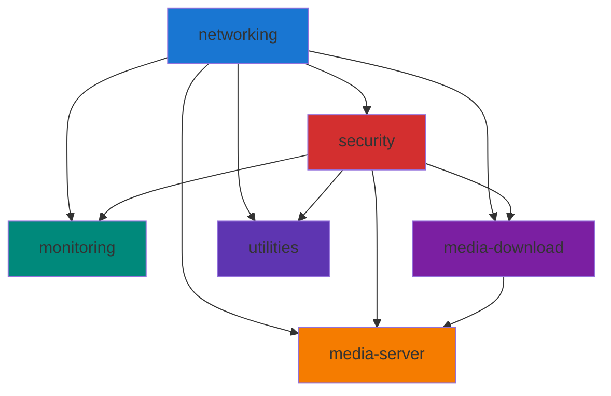

# :material-layers: Docker Stacks

Modular infrastructure with separate directories and Docker networks for clean organization and enhanced security.

!!! success ":material-check-decagram: Modular Design Benefits"
    Independent updates, isolated failures, easier backups, and better troubleshooting!

-----

## :material-view-list: Stack Overview

|Stack             |Services|Directory              |Networks             |Compose File        |
|------------------|--------|-----------------------|---------------------|--------------------|
|**networking**    |3       |`docker/1-networking`    |proxy                |`docker-compose.yml`|
|**security**      |4       |`docker/2-security`      |security-net, proxy  |`docker-compose.yml`|
|**monitoring**    |4       |`docker/3-monitoring`    |monitoring-net, proxy|`docker-compose.yml`|
|**media-download**|7       |`docker/4-media-download`|media-backend, proxy |`docker-compose.yml`|
|**media-server**  |6       |`docker/5-media-server`  |media-backend, proxy |`docker-compose.yml`|
|**utilities**     |3       |`docker/6-utilities`     |utils-net, proxy     |`docker-compose.yml`|

**Total Containers:** 28 | **Total Stacks:** 6 | **All running on:** Docker Compose

-----

## :material-network: networking

**Purpose:** Reverse proxy, ingress routing, and secure tunneling

**Directory:** `docker/1-networking/`

**Networks:** `proxy` (external)

|Service    |Version|Purpose            |Ports        |
|-----------|-------|-------------------|-------------|
|Traefik    |latest |Reverse proxy & SSL|80, 443, 8080|
|Cloudflared|latest |Cloudflare Tunnel  |-            |
|Tailscale  |latest |VPN mesh network   |-            |

**Key Features:**

- :material-certificate: Automatic SSL certificates via Let’s Encrypt
- :material-cloud: Secure external access without port forwarding
- :material-vpn: Private VPN for admin access
- :material-router: Dynamic routing via Docker labels

**Status:** ✅ Active

??? example "Stack Management Commands"
    ```bash
    # Navigate to stack directory
    cd docker/1-networking
    # Start stack
    docker compose up -d

    # Stop stack
    docker compose down

    # View logs
    docker compose logs -f

    # Restart a specific service
    docker compose restart traefik

    # Pull latest images
    docker compose pull
    ```

-----

## :material-shield-lock: security

**Purpose:** Authentication, SSO, and intrusion prevention

**Directory:** `docker/2-security/`

**Networks:** `security-net`, `proxy` (external)

|Service             |Version|Purpose       |Database  |
|--------------------|-------|--------------|----------|
|Authentik           |latest |SSO provider  |PostgreSQL|
|Authentik PostgreSQL|16     |Auth database |-         |
|CrowdSec            |latest |IPS           |SQLite    |
|Cloudflare Bouncer  |latest |CF integration|-         |

**Key Features:**

- :material-account-key: Single Sign-On for all services
- :material-shield-check: Real-time threat detection
- :material-cloud-lock: Edge-level IP blocking
- :material-two-factor-authentication: MFA support

**Status:** 🛡️ Secure

!!! danger ":material-alert: Critical Stack"
    This stack contains your master authentication system. Never take it down without a plan!

??? example "Stack Management Commands"
    ```bash
    cd docker/2-security
    docker compose up -d
    docker compose logs -f authentik

    # Backup Authentik database
    docker compose exec authentik-db pg_dump -U authentik > backup.sql
    ```

-----

## :material-monitor-dashboard: monitoring

**Purpose:** Dashboards, logging, and analytics

**Directory:** `docker/3-monitoring/`

**Networks:** `monitoring-net`, `proxy` (external)

|Service  |Version|Purpose          |Access|
|---------|-------|-----------------|------|
|Homepage |latest |Service dashboard|Web UI|
|Dozzle   |latest |Log viewer       |Web UI|
|Tautulli |latest |Plex analytics   |Web UI|
|Notifiarr|latest |Notifications    |Web UI|

**Key Features:**

- :material-view-dashboard: Unified service status dashboard
- :material-text-box-search: Real-time container logs
- :material-chart-line: Plex usage statistics
- :material-bell-ring: Discord/Slack notifications

**Status:** 👁️ Watching

??? example "Stack Management Commands"
    ```bash
    cd docker/4-monitoring
    docker compose up -d
    docker compose logs -f dozzle

    # Restart Homepage to reload config
    docker compose restart homepage
    ```

-----

## :material-download: media-download

**Purpose:** Automated media acquisition and management

**Directory:** `docker/4-media-download/`

**Networks:** `media-backend`, `proxy` (external)

|Service   |Version|Purpose          |Type       |
|----------|-------|-----------------|-----------|
|Prowlarr  |latest |Indexer manager  |Management |
|Radarr    |latest |Movie automation |Acquisition|
|Sonarr    |latest |TV automation    |Acquisition|
|SABnzbd   |latest |Usenet downloader|Downloader |
|Seerr     |latest |Request interface|Frontend   |
|Notifiarr |latest |Notifications    |Alerts     |
|Starrproxy|latest |API proxy        |Backend    |

**Key Features:**

- :material-file-search: Centralized indexer management
- :material-robot: Automatic quality upgrades
- :material-ticket: User-friendly request system
- :material-download: Efficient Usenet downloading

**Status:** 📥 Running

??? example "Stack Management Commands"
    ```bash
    cd docker/4-media-download
    docker compose up -d
    # View Sonarr logs for troubleshooting
    docker compose logs -f sonarr

    # Restart all *arr apps
    docker compose restart sonarr radarr prowlarr
    ```

-----

## :material-plex: media-server

**Purpose:** Media streaming and library management

**Directory:** `docker/5-media-server/`

**Networks:** `media-backend`, `proxy` (external)

|Service         |Version|Purpose         |Function    |
|----------------|-------|----------------|------------|
|Plex            |latest |Media server    |Streaming   |
|Kometa          |latest |Metadata manager|Automation  |
|Title Card Maker|latest |Episode cards   |Artwork     |
|Unmanic         |latest |Transcoder      |Optimization|
|Posterizarr     |latest |Poster manager  |Artwork     |
|ImageMaid       |latest |Image cleanup   |Maintenance |

**Key Features:**

- :material-play: High-quality media streaming
- :material-palette: Automated collections and metadata
- :material-card-text: Custom episode title cards
- :material-video-box: Media file optimization

**Status:** ▶️ Streaming

??? example "Stack Management Commands"
    ```bash
    cd docker/5-media-server
    docker compose up -d

    # Restart Plex (be careful during active streams!)
    docker compose restart plex

    # Run Kometa manually
    docker compose run --rm kometa
    ```

-----

## :material-tools: utilities

**Purpose:** Miscellaneous tools and services

**Directory:** `docker/6-utilities/`

**Networks:** `utils-net`, `proxy` (external)

|Service   |Version|Purpose           |Auth     |
|----------|-------|------------------|---------|
|Filebrowser Quantum| beta| FileBrowser | Authentik|
|Immich    |latest |Photo management  |Immich   |
|Privatebin|latest |Encrypted pastebin|None     |
|These Docs|latest |Documentation wiki|Authentik|

**Key Features:**

- :material-folder-file: Self-hosted file browser
- :material-image-multiple: Self-hosted photo backup
- :material-note-text-outline: Secure text sharing
- :material-book-open-page-variant: Internal documentation

**Status:** 🔧 Ready

??? example "Stack Management Commands"
    ```bash
    cd docker/6-utilities
    docker compose up -d

    # Rebuild docs after changes
    docker compose restart docs

    # View Immich logs
    docker compose logs -f immich
    ```

-----

## :material-file-tree: Directory Structure

    ```tree
docker/
├── networking/
│   ├── traefik/
│   │   ├── config/
│   │   └── docker-compose.yml
│   ├── cloudflared/
│   │   └── docker-compose.yml
│   └── tailscale/
│       └── docker-compose.yml
├── security/
│   ├── authentik/
│   │   ├── media/
│   │   ├── templates/
│   │   └── docker-compose.yml
│   └── crowdsec/
│       ├── config/
│       └── docker-compose.yml
├── monitoring/
│   ├── homepage/
│   ├── dozzle/
│   └── tautulli/
│       └── docker-compose.yml
├── media-download/
│   ├── prowlarr/
│   ├── radarr/
│   ├── sonarr/
│   └── sabnzbd/
│       └── docker-compose.yml
├── media-server/
│   ├── plex/
│   ├── kometa/
│   └── unmanic/
│       └── docker-compose.yml
└── utilities/
    ├── filebrowser/
    ├── immich/
    ├── privatebin/
    └── docs/
        └── docker-compose.yml
    ```

-----

## :material-cog: Stack Management

### :material-update: Updating a Stack

```bash
# Navigate to stack directory
cd docker/[stack-name]

# Pull latest images
docker compose pull

# Recreate containers with new images
docker compose up -d

# Remove old images
docker image prune -f
```

### :material-restart: Restarting a Stack

```bash
cd docker/[stack-name]
docker compose restart
```

### :material-stop: Stopping a Stack

```bash
cd docker/[stack-name]
docker compose down
```

### :material-play: Starting a Stack

```bash
cd docker/[stack-name]
docker compose up -d
```

### :material-file-document-outline: Viewing Logs

```bash
cd docker/[stack-name]

# All services
docker compose logs -f

# Specific service
docker compose logs -f [service-name]

# Last 100 lines
docker compose logs --tail=100 -f
```

-----

## :material-backup-restore: Backup Strategy

Each stack’s data should be backed up regularly:

|Stack             |Backup Priority|Key Data                    |
|------------------|---------------|----------------------------|
|**security**      |🔴 Critical     |Authentik DB, configs       |
|**media-download**|🟠 High         |*arr databases, configs     |
|**media-server**  |🟠 High         |Plex metadata, configs      |
|**monitoring**    |🔵 Medium       |Tautulli DB, Homepage config|
|**utilities**     |🟠 High         |Immich photos, DB           |
|**networking**    |🔵 Medium       |Traefik config              |

!!! tip ":material-backup-restore: Backup Command"
    `bash # Example: Backup entire docker directory tar -czf homelab-backup-$(date +%Y%m%d).tar.gz docker/`

-----

## :material-alert-circle: Dependency Chain

Understanding stack dependencies helps with maintenance:



**Startup Order:**

1. `networking` (Traefik must be first)
2. `security` (Authentik needed for SSO)
3. All other stacks (order doesn’t matter)

-----

## :material-frequently-asked-questions: Common Tasks

### Update All Stacks

```bash
#!/bin/bash
for stack in networking security monitoring media-download media-server utilities; do
    echo "Updating $stack..."
    cd docker/$stack
    docker compose pull
    docker compose up -d
    cd ../..
done
```

### Check All Stack Status

```bash
#!/bin/bash
for stack in networking security monitoring media-download media-server utilities; do
    echo "=== $stack ==="
    cd docker/$stack
    docker compose ps
    cd ../..
done
```

-----

## :material-lightbulb: Design Philosophy

!!! question "Why separate stacks instead of one big compose file?"
    **Isolation and maintainability.** Each stack can be updated, restarted, or backed up independently without affecting others.

!!! question "Why use external networks?"
    **Security through segmentation.** Services only connect to networks they need, preventing unauthorized communication.

!!! question "Why keep services in their own directories?"
    **Clean organization.** Config files, volumes, and compose files are grouped together logically.

-----

## :material-link-variant: Related Documentation

- **[Services Inventory](services.md)** - Detailed info on each container
- **[Network Architecture](networking.md)** - How networks connect
- **[Quick Commands](../reference/quick-commands.md)** - Useful Docker commands
- **[Troubleshooting](../reference/troubleshooting.md)** - Common issues

-----

<div class="center" markdown>

**Happy stacking!** :material-docker:

</div>
